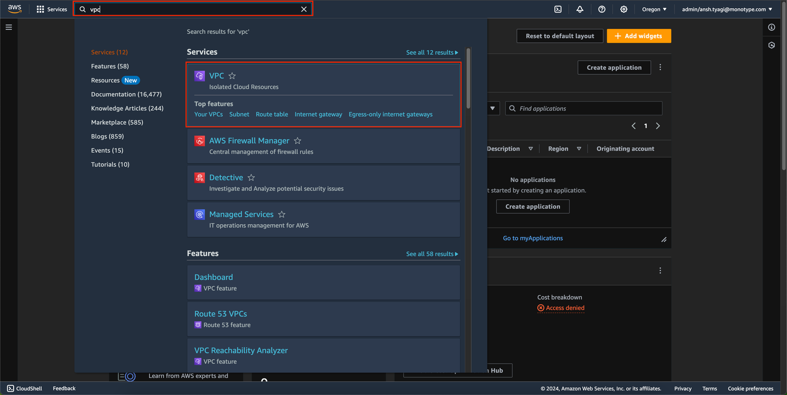
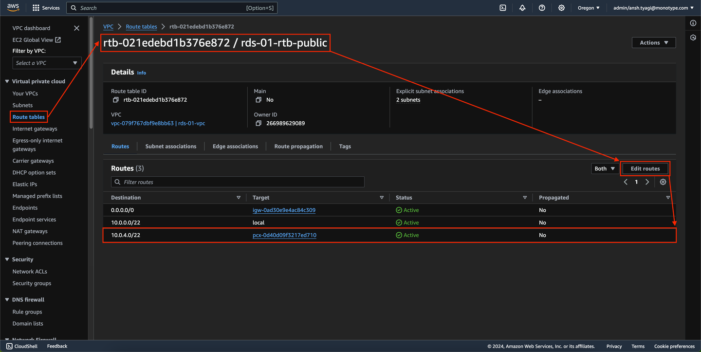
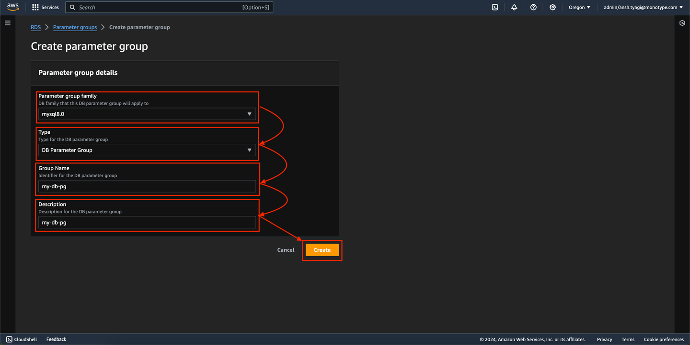
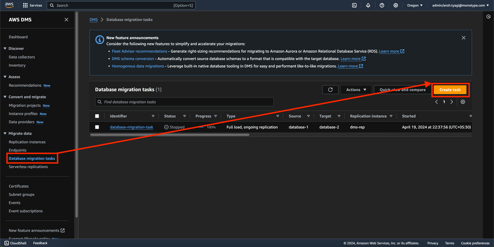

# Implement cross-region disaster recovery with AWS DMS and AWS RDS MySQL

 Architecture diagram of the AWS RDS disaster recovery 

 AWS Data Migration Service working 

## Context

Cross-region disaster recovery (DR) is crucial for ensuring high availability and data durability across geographically dispersed data center's. Utilising AWS DMS and RDS MySQL enhances fault tolerance by replicating databases between AWS regions.

## Requirement

- Establish a disaster recovery system between two AWS regions (us-west-2 and eu-west-2).
- Use AWS DMS for data replication and AWS RDS MySQL for database management.
- Maintain a real-time data sync with minimal downtime and data loss.

## Steps

### Step 1 - VPC Peering

| Warning |
| --- |
| Before initiating a VPC peering connection, ensure that the CIDR blocks of both VPCs in the us-west-2 and eu-west-2 regions do not overlap. This check is crucial for enabling AWS DMS connectivity with RDS in the eu-west-2 region. |

1. Log into the AWS Management Console, navigate to the VPC dashboard in the us-west-2 region.

 AWS Management Console 

2. Select "Peering Connections" from the left navigation panel and click "Create Peering Connection" at the top right.

 Peering connections dashboard 

3. Enter a name for the peering connection, under the VPC (Requester) section, select the VPC ID and choose "My account" and "Another region", specify the VPC ID (Accepter) located in the eu-west-2 region, click "Create Peering Connection".

 Create peering connection process 

4. Switch to the AWS Management Console for the eu-west-2 region, under "Peering Connections", locate the pending request and select "Accept Request", confirm the acceptance to establish the peering connection.

 Accepting peering connection request 

5. For both VPCs in us-west-2 and eu-west-2, go to the "Route Tables" section, edit the public route table: add the opposite VPC’s CIDR block as the destination and the newly created peering connection ID as the target.

 Route table of us-west-2 region 

### Step 2 - RDS Preparation

1. In the AWS Management Console, create an RDS instance in the eu-west-2 region using the same instance configuration as the one in us-west-2.

 Same instance configuration RDS in different region 

2. Create a database parameter group for both RDS instances, modify the binlog_format parameter to ROW within these groups.

 Create parameter group 

 Create parameter group process 

 Select the parameter group just created 

 Edit the parameter group 

 Search for the binlog_format parameter and modify it to ROW and Save Changes 

3. For each RDS instance in both the us-west-2 and eu-west-2 regions, attach the newly created parameter group.

 Select the instance and click on Modify 

 Choose the newly created DB parameter group in the list and click continue 

 Select Apply immediately and click Modify DB Instance to complete the process 

| Warning |
| --- |
| Verify that binary logging is enabled and that each RDS instance has a unique server_id. This can be confirmed by executing the queries SHOW VARIABLES LIKE 'log_bin'; to check if log_bin is set to 'ON', and SHOW VARIABLES LIKE 'server_id'; to ensure that the server_id differs across the instances. Run these queries within your database management tool. |

 Verifying through SQLECTRON 

### Step 3 - AWS DMS

1. Navigate to AWS DMS in the AWS Management Console. In the left navigation panel, select "Replication Instances" and then click on "Create Replication Instance."

 Create replication instance 

2. Enter the replication instance name, choose the instance class and engine version, set High Availability to "Single-AZ," select the appropriate VPC, replication subnet group, and security group. Finally, click "Create Replication Instance."

 Create replication instance process 

3. Return to AWS DMS and select "Endpoints" from the left navigation panel, then click "Create Endpoint."

 Create endpoint 

4. For the source endpoint, provide the endpoint identifier using the RDS name, select the source engine matching the RDS, choose "Provide information manually," and then enter the RDS endpoint as the server name, along with the port, username, and password. Select the VPC and the replication instance, then click "Run Test." Wait until the status shows "Successful," then click "Create Endpoint."

 Create endpoint process 

5. Repeat step 4 to create the target endpoint, ensuring to specify the RDS details for the region eu-west-2.

6. Return to the AWS DMS dashboard and select "Database Migration Tasks" from the left panel. Click "Create Task" in the top right corner.

 Create task 

7. Provide a task identifier as the task name. Select the replication instance, source database endpoint, and target database endpoint created in steps 2, 4, and 5. Set the migration type to "Migrate existing data and replicate ongoing changes." Under table mappings, click "Add new selection rule." For the schema, enter the schema name, specify the source database name from which you want to replicate data, and for the source table name, specify the table you wish to replicate. Set “Start migration task” to "Manually later" and then click "Create Task."

 Create database migration task process 

| Note |
| --- |
| If you need to migrate all databases and tables from one RDS instance to another, use the '%' wildcard in both the source database name and source table name fields to include everything. If only specific patterns of databases and tables are to be migrated, append the pattern with '_%'. |
| For example, if your databases are named mydb_01, mydb_02, and mydb_03, use 'mydb_%' to migrate all databases following this naming convention. Similarly, if the tables are named table_01, table_02, and table_03, use 'table_%' to include all corresponding tables in the migration. |

8. Select the database migration task you just created, go to "Actions," and choose "Resume/Restart" to start the task.

 Start the task just created 

| Success |
| --- |
| This process will initially move the database and tables specified in the selection rule and will then continue to replicate the data. |

## Costing

- AWS DMS and RDS costs depend on instance types, storage, and data transfer volumes.
- Costing should include the price of cross-region data transfers and additional instances for replication.
- Implementing a pilot light or warm standby approach may reduce costs compared to a multi-site approach.

## RTO and RPO 

- RTO: Targeted at less than 1 hour, depending on the complexity of the application recovery process.
- RPO: Aim for near-zero data loss by maintaining continuous replication.

## Limitations

- Overlapping CIDR blocks in VPC peering can block the setup.
- Data transfer speeds and latency between regions can affect synchronisation.
- Binary logging in MySQL increases storage requirements and may impact performance.

## Monitoring

- Use AWS CloudWatch for monitoring database and replication instance metrics.
- Set alarms for replication failures, high latency, or excessive read/write loads.
- Regularly check the health of VPC peering connections and database instances.

## Consequences

- Failure in setting up or maintaining the disaster recovery process can lead to data loss or unavailability during regional AWS outages.
- Improper configuration might result in excessive charges or performance degradation.

